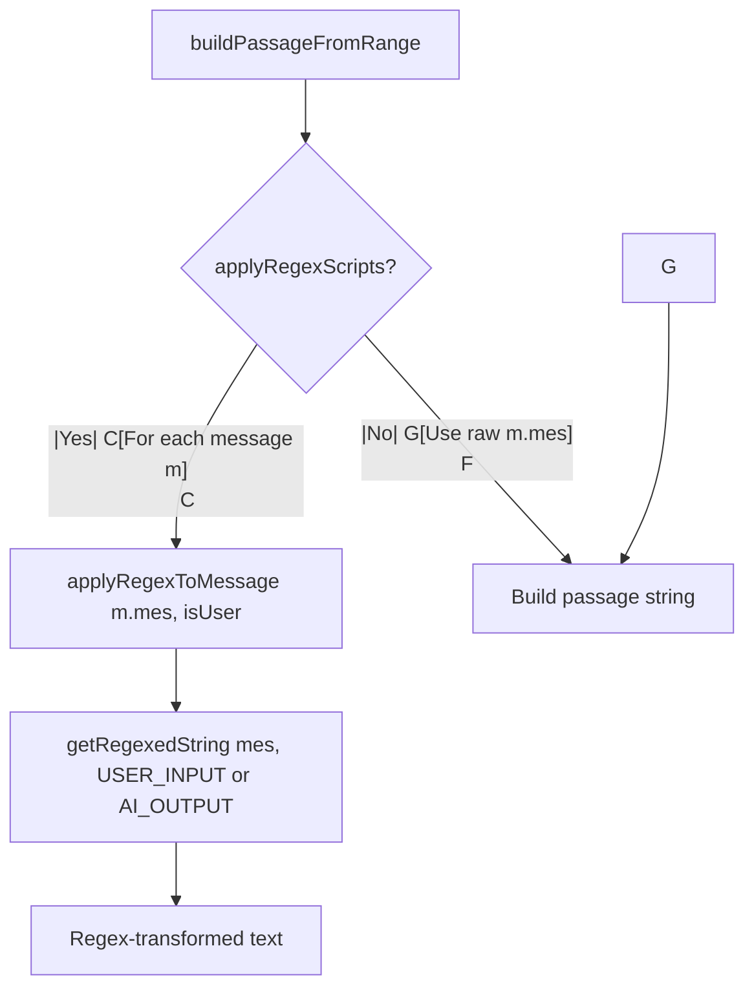

## Plan: Apply ST Regex Scripts to Summarizer Passage Text

### Problem
`buildPassageFromRange()` in `src/core/chatutils.js` reads raw `m.mes` without applying SillyTavern's regex scripts. The summarizer sees unprocessed text while the RP model sees regex-transformed text (e.g. thinking blocks not stripped, name replacements not applied, formatting not cleaned).

### Approach
Add a regex application step in `buildPassageFromRange()` that calls ST's `getRegexedString()` for each message, using the appropriate placement enum (`USER_INPUT` for user messages, `AI_OUTPUT` for assistant messages). This matches exactly what ST itself does in `script.js` when preparing chat context for the RP model.

ST's `getRegexedString` internally handles all script filtering: disabled scripts, `markdownOnly`/`promptOnly` flags, depth limits, character-scoped scripts, and preset scripts. No manual filtering needed.

### Import Strategy
Use a **dynamic import with graceful fallback** to avoid hard coupling to ST's module path (which could change between ST versions):

```js
// New file: src/core/regex-proxy.js
let _regexModule = null;

export async function applyRegexToMessage(mes, isUser) {
    if (!mes || typeof mes !== 'string') return mes;
    try {
        if (!_regexModule) {
            _regexModule = await import(
                '../../../../scripts/extensions/regex/engine.js'
            );
        }
        const placement = isUser
            ? _regexModule.regex_placement.USER_INPUT
            : _regexModule.regex_placement.AI_OUTPUT;
        return _regexModule.getRegexedString(mes, placement);
    } catch (e) {
        // Fallback: return raw text if regex engine unavailable
        return mes;
    }
}
```

**Why dynamic import:** The extension currently uses zero dynamic imports and the path `../../../../scripts/extensions/regex/engine.js` is relative to the extension's installed location inside `third-party/Extension-Summaryception/src/core/`. If ST reorganizes this module in a future version, the dynamic import fails gracefully and the extension continues working with raw text. A static import would crash the entire extension on load.

**Why a separate module:** Keeps `chatutils.js` clean and isolates the ST-specific import path. The module caches the import so the dynamic import overhead is paid only once.

### Changes to `buildPassageFromRange()`

The function must become `async` (it currently is sync). Two callers need updating:

1. **`summarizer-batch.js` → `performBatchSummary()`** - Already async, change `const storyTxt = buildPassageFromRange(...)` to `const storyTxt = await buildPassageFromRange(...)`.

2. **`summarizer-promotion.js` → `mergeLayerSnippets()`** - Does NOT call `buildPassageFromRange` (it uses `toMerge.map(sn => sn.text).join(' ')` on existing snippets). No change needed.

### File-level changes:

| File | Change |
|------|--------|
| `src/core/regex-proxy.js` | NEW: dynamic import wrapper with fallback |
| `src/core/chatutils.js` | `buildPassageFromRange` becomes async, applies regex per message |
| `src/core/summarizer-batch.js` | Add `await` to `buildPassageFromRange` call |
| `src/foundation/constants.js` | Add `applyRegexScripts: true` setting (toggle in UI) |

### Settings toggle
Add a boolean `applyRegexScripts` (default `true`) to `defaultSettings` in `constants.js` so users can disable regex application if it causes issues with their specific scripts. Check this flag in `buildPassageFromRange` before applying regex.



### No changes needed for:
- `getVisibleAssistantTurns` / `getAssistantTurns` - these only read metadata, not message content for summarization
- `buildFullContext` - operates on already-summarized snippets, not raw chat text
- Injection - operates on summary snippets, not raw chat text
- `commitLayer0Snippet` - stores summary text, not raw chat

### Testing
No test framework in this project. Manual verification: enable `debugMode`, run a summarization cycle with regex scripts active, confirm the passage text in logs matches regex-transformed text (not raw `m.mes`).