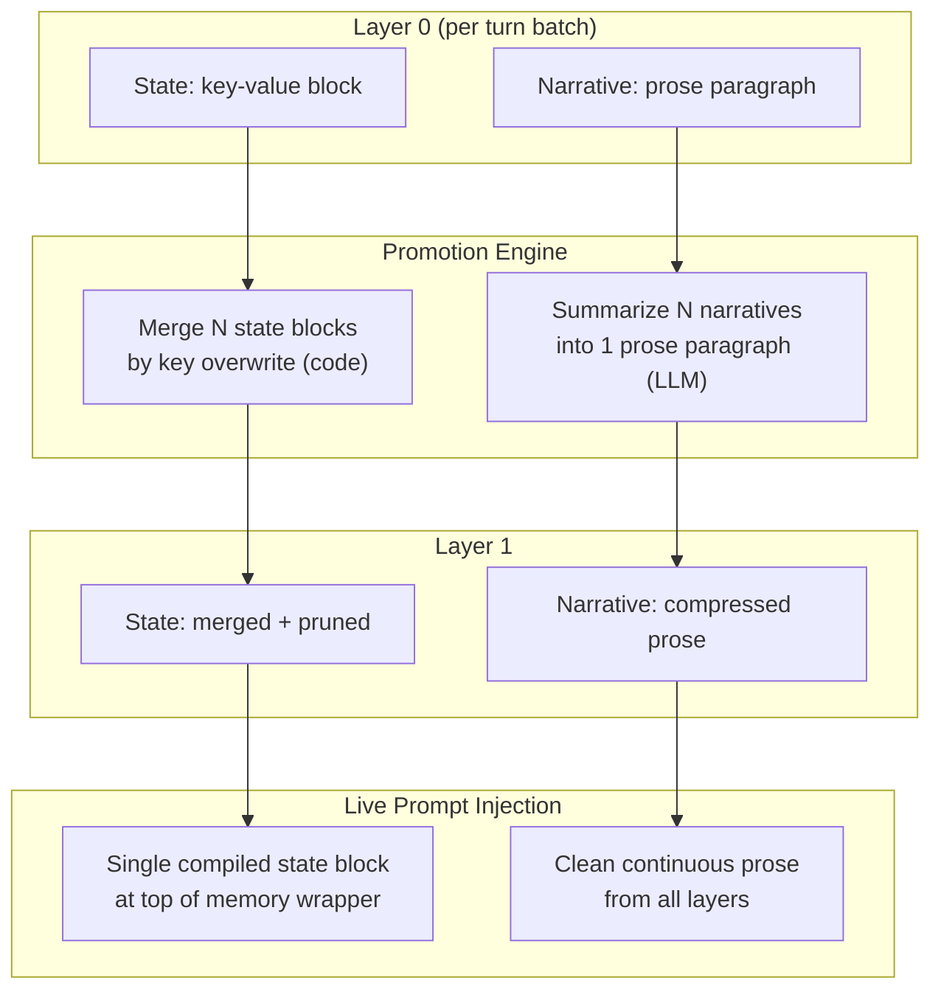

# Spec v5: Dual-Track State + Narrative Memory System

## Problem
The current system treats all summary content as homogeneous prose. Any recurring data point (tally, location, equipment, relationship status, character state) gets re-narrated on every promotion cycle because the LLM cannot distinguish "durable state that should be overwritten" from "narrative events that should be appended." This is generic -- it will happen with ANY RP type (ERP, slice-of-life, sci-fi, etc.).

## Solution: Dual-Track Architecture

Separate each summary into two tracks:
1. **Narrative track** -- free-form prose describing what happened (events, actions, dialogue outcomes)
2. **State track** -- a compact structured block of current durable facts (location, character states, relationships, inventory, unresolved hooks, counters)

On promotion, the state track is **merged by overwrite** (new values replace old), while the narrative track is **compressed by summarization**. This eliminates the root cause: the LLM no longer needs to guess which parts of prose are state vs events.

## Architecture Diagram



## Key Design Principles

1. **State merging is deterministic** -- done in code, not by LLM
2. **State pruning is explicit** -- LLM writes `none`/`empty`/`resolved` to remove keys, omission preserves old value
3. **Injection is clean** -- single compiled state block + continuous prose, not raw snippet-per-snippet dump
4. **Parser is fuzzy** -- tolerates markdown bullets, varied delimiters, key drift
5. **Custom prompts preserved** -- users can customize language/focus but must retain dual-track output format
6. **Key normalization** -- synonym keys are mapped to canonical names to prevent fragmentation
7. **Graceful degradation** -- parser failures never corrupt state; malformed output falls back to narrative-only with prior state preserved
8. **Bounded unclassified notes** -- malformed state lines are capped and deduplicated to prevent a new source of bloat
9. **Consistent merge logic** -- `compileGlobalState` and promotion merge use the same `mergeStates` function
10. **Clean serialization** -- empty/nullify values are omitted from output, never written as empty keys

## Implementation Plan

### 1. New State Block Format (in `constants.js`)

The L0 summarizer outputs two sections per summary:

```
[NARRATIVE]
<one dense prose paragraph, max ~120 tokens>

[STATE]
location: <where>
characters: <name: brief status, ...>
inventory: <active items/equipment>
dynamics: <power/relationship state>
hooks: <unresolved plans/threats>
counters: <name: value, ...>
```

Rules for the LLM:
- State block uses simple `key: value` format (not XML, not JSON)
- Only include keys that **changed** in this passage -- omit unchanged state to save tokens
- To **delete** a key (resolved hook, emptied inventory), explicitly write `key: none` or `key: empty` or `key: resolved`
- Omitting a key entirely means "unchanged" -- the previous value is preserved

### 2. Prompt Changes (in `constants.js`)

**L0 `summarizerSystemPrompt`:**
```
Role: narrative-state dual compressor. Output a [NARRATIVE] paragraph and a [STATE] key-value block. No preamble, no commentary.
```

**L0 `summarizerUserPrompt`:**
Rewrite to instruct the LLM to output both tracks. The narrative section is similar to the current prompt (dense chronological prose, no transition phrases, map 2nd person to player name). Add a `[STATE]` section instruction:

```markdown
Output exactly two sections:

[NARRATIVE]
<one dense prose paragraph covering events, actions, outcomes>

[STATE]
Extract only durable state variables that CHANGED in this passage. Format as key: value (one per line).
To DELETE a resolved/emptied variable, write: key: none
If nothing changed, output [STATE] with no keys below it.

Common keys (use what is relevant, invent new ones if needed):
- location: <current place>
- characters: <name: status, ...>
- inventory: <active items>
- dynamics: <relationship/power state>
- hooks: <unresolved plans/threats>
- counters: <name: value>

Do not narrate events inside [STATE]. Only current facts.
```

**Promotion `promotionSystemPrompt`:**
```
Role: dual-track memory synthesizer. Summarize narrative prose. State blocks are merged separately in code.
```

**Promotion `promotionUserPrompt`:**
The promotion input now separates narrative from state (done in code before the LLM call). The promotion LLM receives only the narrative sections and compresses them. State merging happens programmatically, so the promotion prompt does not need state instructions.

```markdown
The following are narrative summaries to consolidate into one dense paragraph.

<player_name>
{{player_name}}
</player_name>

<prior_context>
{{context_str}}
</prior_context>

<narratives_to_consolidate>
{{story_txt}}
</narratives_to_consolidate>

Consolidate only the NEW events into a compressed continuation. Do not repeat prior_context events. Output ONLY the narrative paragraph -- no headers, no state block, no preamble.
```

### 3. State Parsing Module (new: `src/core/summarizer-state.js`)

```javascript
// Core functions:

/**
 * Parse a full snippet text into { narrative, state }.
 * If no [STATE] block found, entire text is narrative, state = {}.
 * Tolerates: markdown bullets, varied delimiters (:, =, -), key drift.
 */
export function parseSnippet(text) -> { narrative: string, state: Record<string, string> }

/**
 * Merge multiple state objects. Later values overwrite earlier.
 * If a value is "none"/"empty"/"null"/"cleared"/"resolved", remove the key entirely.
 * Omitted keys are preserved (not deleted).
 * unclassified_notes is treated as append-only with deduplication and cap.
 */
export function mergeStates(states: Array<Record<string,string>>) -> Record<string,string>

/**
 * Serialize a state object back to [STATE] block format.
 * Omits empty values and nullify-values from output.
 */
export function serializeState(state: Record<string,string>) -> string

/**
 * Compile all layer snippets into a single unified state object.
 * Uses mergeStates internally for consistency.
 * Used for clean injection into the live prompt.
 */
export function compileGlobalState(layers: Array<Array<{text: string}>>) -> Record<string,string>
```

**Parsing regex** (fuzzy, tolerant):
```javascript
const STATE_LINE_RE = /^\s*[-*]?\s*([a-zA-Z_][\w\s]*?)\s*[:=-]\s*(.+?)\s*$/;
const NULLIFY_VALUES = new Set(['none', 'empty', 'null', 'cleared', 'resolved', 'removed']);
const UNCLASSIFIED_NOTES_MAX = 3; // Hard cap to prevent bloat

/**
 * Key normalization map -- prevents synonym fragmentation.
 * Keys are lowercased and stripped of common prefixes/suffixes,
 * then matched against this alias table.
 *
 * Aliases are matched in order: exact lowercased key, then
 * stripped key (remove "current_", "active_", leading/trailing spaces),
 * then fuzzy match against this table.
 */
const KEY_ALIASES = {
    // Location variants
    'location': 'location',
    'place': 'location',
    'current_place': 'location',
    'current_location': 'location',
    'where': 'location',
    'room': 'location',
    'area': 'location',
    // Characters / people
    'characters': 'characters',
    'people': 'characters',
    'npcs': 'characters',
    'who': 'characters',
    // Inventory / equipment
    'inventory': 'inventory',
    'items': 'inventory',
    'equipment': 'inventory',
    'toys': 'inventory',
    'gear': 'inventory',
    // Dynamics / relationships
    'dynamics': 'dynamics',
    'relationship': 'dynamics',
    'power': 'dynamics',
    'roles': 'dynamics',
    // Hooks / plans
    'hooks': 'hooks',
    'plans': 'hooks',
    'goals': 'hooks',
    'threads': 'hooks',
    'unresolved': 'hooks',
    // Counts
    'counters': 'counters',
    'tally': 'counters',
    'tallies': 'counters',
    'counts': 'counters',
    'score': 'counters',
};
```

**Key normalization logic** (pseudocode):
```javascript
function normalizeKey(rawKey) {
    const cleaned = rawKey.trim().toLowerCase();
    // Direct alias match
    if (KEY_ALIASES[cleaned]) return KEY_ALIASES[cleaned];
    // Strip common prefixes (matches "current_" OR "active_" individually)
    const stripped = cleaned.replace(/^(current_|active_)/g, '').replace(/\s+/g, '_');
    if (KEY_ALIASES[stripped]) return KEY_ALIASES[stripped];
    // No match -- use the cleaned key as-is (emergent key)
    return cleaned;
}
```

**Parse with normalization and fallback**:
```javascript
function parseSnippet(text) {
    const narrativeMatch = text.match(/\[NARRATIVE\][\s\S]*?(?=\[STATE\]|$)/i);
    const stateMatch = text.match(/\[STATE\]([\s\S]*?)(?=\[|$)/i);

    const narrative = narrativeMatch ? narrativeMatch[0].replace(/^\[NARRATIVE\]\s*/i, '').trim() : text.trim();

    if (!stateMatch) {
        // No [STATE] block found -- entire text is narrative, empty state
        // (graceful degradation, never throws)
        return { narrative, state: {} };
    }

    const state = {};
    const unclassified = [];
    const lines = stateMatch[1].trim().split('\n');

    for (const line of lines) {
        const match = line.match(STATE_LINE_RE);
        if (match) {
            const canonicalKey = normalizeKey(match[1]);
            state[canonicalKey] = match[2].trim();
        } else if (line.trim().length > 0) {
            unclassified.push(line.trim());
        }
    }

    // Cap unclassified notes to prevent bloat
    if (unclassified.length > UNCLASSIFIED_NOTES_MAX) {
        state.unclassified_notes = unclassified.slice(0, UNCLASSIFIED_NOTES_MAX).join('; ') + ' [...]';
    } else if (unclassified.length > 0) {
        state.unclassified_notes = unclassified.join('; ');
    }

    return { narrative, state };
}
```

**Merge logic** (pseudocode):
```javascript
function mergeStates(states) {
    const merged = {};
    const allUnclassified = [];

    for (const state of states) {
        for (const [key, value] of Object.entries(state)) {
            if (key === 'unclassified_notes') {
                if (value) allUnclassified.push(value);
                continue;
            }
            const normalized = value.trim().toLowerCase();
            if (NULLIFY_VALUES.has(normalized)) {
                delete merged[key];
            } else {
                merged[key] = value;
            }
        }
    }

    // Consolidate and cap merged unclassified notes (append-only with dedup)
    if (allUnclassified.length > 0) {
        const uniqueNotes = [...new Set(allUnclassified.flatMap(n => n.split('; ')))];
        merged.unclassified_notes = uniqueNotes.slice(0, UNCLASSIFIED_NOTES_MAX).join('; ') +
            (uniqueNotes.length > UNCLASSIFIED_NOTES_MAX ? ' [...]' : '');
    }

    return merged;
}
```

**Serialize with empty-value filtering**:
```javascript
function serializeState(state) {
    const lines = [];
    for (const [key, value] of Object.entries(state)) {
        const trimmed = (value || '').trim();
        // Skip empty values and nullify-values (they should have been deleted in merge,
        // but this is a defensive guard for direct serialize calls)
        if (trimmed && !NULLIFY_VALUES.has(trimmed.toLowerCase())) {
            lines.push(`${key}: ${trimmed}`);
        }
    }
    return lines.length > 0 ? `[STATE]\n${lines.join('\n')}` : '';
}
```

**Compile global state (uses same merge logic)**:
```javascript
function compileGlobalState(layers) {
    const allStates = [];
    for (const layer of layers || []) {
        for (const sn of layer || []) {
            const { state } = parseSnippet(sn.text);
            if (Object.keys(state).length > 0) {
                allStates.push(state);
            }
        }
    }
    // Uses the same mergeStates function as promotion --
    // dedup, nullify, and unclassified_notes capping are identical
    return mergeStates(allStates);
}
```

### 4. Promotion Logic Changes (in `summarizer-promotion.js`)

In `mergeLayerSnippets()`:

```javascript
// 1. Parse each source snippet
const parsed = toMerge.map(sn => parseSnippet(sn.text));

// 2. Join narratives for LLM summarization
const narrativeInputs = parsed.map(p => p.narrative).join('\n\n---\n\n');

// 3. Merge state blocks programmatically (no LLM)
const mergedState = mergeStates(parsed.map(p => p.state));

// 4. Call LLM for narrative only
const metaNarrative = await callSummarizer(narrativeInputs, contextStr, { ... });

// 5. Combine result
const metaSummary = serializeState(mergedState)
    ? `${metaNarrative}\n\n${serializeState(mergedState)}`
    : metaNarrative;
```

### 5. Clean Prompt Injection (in `summarizer.js` / `chatutils.js`)

Currently `buildFullContext()` concatenates all snippet text raw. This must change:

```javascript
// New approach for live prompt injection:

/**
 * Build injection string with clean structure:
 * [CURRENT STATE]
 * key: value (one per line, compiled from all layers)
 *
 * [CHRONOLOGY]
 * <continuous prose from all layers, narratives only>
 */
export function buildMemoryInjection() {
    const layers = getChatStore().layers;
    const globalState = compileGlobalState(layers);
    const narratives = [];

    // Collect narratives from deepest to shallowest
    for (let i = layers.length - 1; i >= 0; i--) {
        for (const sn of (layers[i] || [])) {
            const { narrative } = parseSnippet(sn.text);
            if (narrative.trim()) narratives.push(narrative);
        }
    }

    const parts = [];
    if (Object.keys(globalState).length > 0) {
        parts.push('[CURRENT STATE]');
        for (const [k, v] of Object.entries(globalState)) {
            parts.push(`${k}: ${v}`);
        }
        parts.push('');
    }
    parts.push('[CHRONOLOGY]');
    parts.push(narratives.join(' '));

    return parts.join('\n');
}
```

The `injectionTemplate` in `constants.js` updates to match:
```
<summaryception_memory>
This is condensed continuity memory from older chat turns. The [CURRENT STATE] block contains active facts. The [CHRONOLOGY] section contains older narrative. Use both as factual background.

{{summary}}
</summaryception_memory>
```

The `buildFullContext()` function (used by the promotion LLM to see prior context) also needs the same treatment -- when building context for the promotion summarizer, separate state from narrative so the LLM sees clean prose + prior state.

### 6. Custom Prompt Handling (NOT dropped)

Instead of removing the prompt profile system entirely, we keep it with constraints:

- Keep `promptPreset` / `promotionPromptPreset` / `savedCustomPrompts` / `savedCustomPromotionPrompts`
- Add a validation/UI hint: custom prompts **must** include `[NARRATIVE]` and `[STATE]` output instructions
- The default (`narrative`) preset uses the new dual-track format
- If a custom prompt is selected, the system warns that it must produce dual-track output
- Remove the `lastCustomPrompt` / `lastCustomPromotionPrompt` auto-save complexity (keep only the saved named prompts)

This preserves flexibility for users who need language translation or specific narrative focus, while the default path is fully optimized.

### 7. Data Migration

Existing summaries have no `[STATE]` block. The parser handles this:
- `parseSnippet("Friday Oct 18, 2024...first date...")` -> `{ narrative: "Friday Oct 18...", state: {} }`
- On next promotion, the merged output will include state from new L0 summaries
- State accumulates gradually as new L0 summaries are generated
- No explicit migration or data transformation needed

### 8. Settings UI Changes (in `settings.html` and `ui.js`)

**Keep:**
- Prompt preset dropdown (now with `narrative` as the only built-in option)
- Custom prompt textareas for both L0 and promotion
- Save/load custom prompt buttons

**Add:**
- Help text under custom prompts: "Custom prompts must output [NARRATIVE] and [STATE] sections"
- A small "Format" hint showing the expected output structure

**Remove:**
- `lastCustomPrompt` / `lastCustomPromotionPrompt` auto-save behavior (simplify UX)

## Files to Modify

| File | Change |
|------|--------|
| `src/foundation/constants.js` | New dual-track default prompts, update injectionTemplate |
| `src/foundation/state.js` | Remove `lastCustomPrompt`/`lastCustomPromotionPrompt` backfill, keep preset infrastructure |
| `src/core/summarizer-state.js` | **NEW** -- parser, merger, serializer, global compiler |
| `src/core/summarizer-promotion.js` | Parse dual-track input, merge state in code, LLM only for narrative |
| `src/core/summarizer-request.js` | Minor: pass narrative-only input to promotion calls |
| `src/core/chatutils.js` | New `buildMemoryInjection()` with clean state + chronology format |
| `src/core/summarizer.js` | Use new `buildMemoryInjection()` for live prompt context |
| `src/entry/ui.js` | Keep preset UI, add help text, remove auto-save behavior |
| `src/entry/ui-events.js` | Simplify preset handling, remove auto-save migration |
| `src/entry/settings.html` | Add help text for custom prompt format requirement |

## Risk Mitigation

- **LLM format compliance:** Fuzzy parser tolerates bullets, varied delimiters, key drift. If no `[STATE]` marker found, entire output is treated as narrative with empty state (never throws, never corrupts).
- **Key fragmentation prevention:** `KEY_ALIASES` map normalizes synonyms (`place`, `current_location`, `room` all become `location`). Emergent keys not in the alias table are preserved as-is.
- **Unclassified notes handling:** Malformed state lines are collected into `unclassified_notes` with a hard cap of 3 entries. During merge, unclassified notes are appended (not overwritten) and deduplicated, preventing both data loss and bloat.
- **Clean serialization:** `serializeState` filters out empty values and nullify-values, so the stored `[STATE]` block never contains dead keys.
- **Consistent merge logic:** `compileGlobalState` uses the same `mergeStates` function as promotion, ensuring identical dedup/nullify/cap behavior in both paths.
- **Token budget:** Single compiled state block + continuous prose is MORE token-efficient than raw snippet-per-snippet injection.
- **Backward compatibility:** Existing chats without state blocks parse to `{ narrative, state: {} }`. System self-heals within one promotion cycle.
- **Omitted state preservation:** Keys missing from a new snippet are NOT deleted (no accidental data loss). Only explicit `none`/`empty`/`resolved` trigger deletion.
- **Custom prompt safety:** Users who customize prompts retain flexibility but get clear format requirements.
- **Small model resilience:** Parser never throws on malformed output. Worst case: narrative-only output with prior state carried forward unchanged.

## What This Solves

1. **Tally/counter bloat** -- counters merged by overwrite in code, not re-narrated by LLM
2. **Stale hooks** -- resolved hooks explicitly pruned via `hooks: none`, stable hooks preserved by omission
3. **Location/state drift** -- location overwritten on change, preserved when omitted
4. **Generic applicability** -- works for any RP type because state keys are emergent, not hardcoded
5. **Deterministic state merging** -- no LLM involved in state propagation, eliminating the core failure mode
6. **Clean prompt injection** -- compiled state + continuous prose, not raw 30-snippet dump
7. **Model confusion prevention** -- narrative is clean prose, state is structured separately, no format bleed into chat
