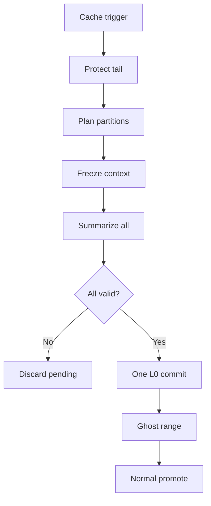

I understand the task now. I will implement Cache-Friendly auto-flush as atomic all-or-nothing, keep Force Summary and Slop Breaker as sequential partial commits, and make partitioning DRY across cache/force/slop.

Key decision on UI settings:
- I will not add a new UI option.
- I will not use `maxSummaryTurns` as the main splitter because turns are not token-safe, a few huge turns can still create a spike.
- I will use `minSummaryBudget` as the preferred/soft L0 source target because that is already the user's cadence knob for "how much raw text is worth summarizing".
- I will add an internal hard safety ceiling for L0 source partitions so the soft target cannot balloon into 16k+ chunks when `minSummaryBudget` is high.
- To avoid bad splits like `8250` tokens becoming two tiny `4125` chunks when the target is `8000`, I will use a tolerance: if the whole candidate range is only slightly above the target/ceiling, keep it as one partition. Otherwise partition with balanced chunks.

Concrete implementation plan:
1. Add a shared core partition planner, likely `src/core/partition-planner.js`.
   - It will count source tokens with existing regex-aware token utilities.
   - It will choose assistant-turn boundaries only.
   - It will prefer `settings.minSummaryBudget` as the soft target, clamped by an internal hard cap and a small overshoot tolerance.
   - It will preserve `minSummaryTurns`/`maxSummaryTurns` as secondary cadence hints only where safe, not as the primary token spike guard.

2. Refactor planners to use the shared partitioner.
   - `verbatim-window.js`: Force/normal overflow plan returns a token-balanced next batch instead of `overflowTurns.slice(0, maxSummaryTurns)`.
   - `cache-planner.js`: Cache auto-flush computes protected tail, then returns all overflow partitions, not just one max-turn batch.
   - `slop-breaker.js`: Slop target remains latest assistant, or previous assistant if latest countable message is user, then uses the shared partitioner.

3. Add atomic Cache-Friendly L0 execution.
   - Add a multi-partition path in `summarizer-batch.js` or adjacent core module.
   - For cache auto-flush only, summarize every partition sequentially into a transient `pendingSnippets` array.
   - Every partition gets the same frozen existing memory context, no new L0 snippets are injected mid-run.
   - Do not mutate `store.layers`, `store.summarizedUpTo`, injection, chat save, or ghosting until all partitions succeed.
   - If any partition aborts, goes stale, fails validation, or the chat/store snapshot changes, discard pending snippets and leave chat/memory untouched.
   - For provider route failures, preserve the requested infinite cycle behavior: primary attempts, fallback attempts, sleep/backoff, repeat until success or abort/stale.

4. Add one guarded cache commit.
   - On success, append all pending L0 snippets in one store mutation.
   - Update `summarizedUpTo` once to the final committed source end.
   - Call `bumpSummaryStoreMutationEpoch(store)` once.
   - Update injection/save once.
   - Ghost the full committed source range once.
   - Then run the normal DRY promotion cycle sequentially, one promotion commit at a time.

5. Keep manual paths sequential.
   - Force Summary and Slop Breaker continue to commit each L0 partition one by one, keeping partial progress if user cancels or the page is interrupted.
   - They still benefit from balanced token partitioning.

6. Add/update tests.
   - Partition planner tests for balanced chunks, assistant-boundary cuts, slight-over-target tolerance (`8250` near `8000` stays one chunk), and huge single-turn fallback.
   - Cache planner tests for protected 4k-8k tail and multi-partition overflow.
   - Summarizer/cache execution tests for all-or-nothing commit, frozen context reuse, no ghosting/injection before success, and discard-on-stale/abort/validation failure.
   - Force/Slop tests confirming sequential partial commits remain unchanged except for token-balanced batch selection.

7. Verification.
   - Run the relevant Vitest files while iterating.
   - Run `npm test` before finishing, per repo instructions.

Legend: this atomic flow applies to Cache auto-flush only. Force and Slop use the same partition planner but keep sequential commits.