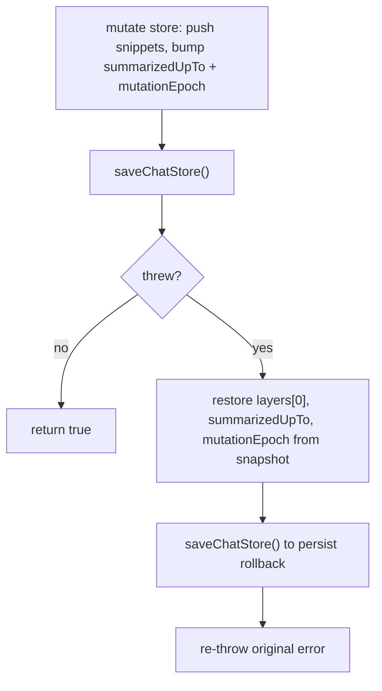

# Fix P2 — Rollback on atomic commit persistence failure

## Problem
`commitAtomicLayer0Snippets` (and the legacy `commitLayer0Snippet`) mutate the store, call `saveChatStore()`, then run `updateCommittedInjection` / `ghostMessagesInRange` / `persistChatState` sequentially. If any *post-save* step throws, the exception bubbles up but the store and metadata have already been persisted with advanced `summarizedUpTo`, new snippets, and bumped `mutationEpoch`. Ghosting/injection never ran. The atomic contract (any failure discards all pending snippets) is violated for persistence failures.

## Solution
Add a small shared helper that snapshots the three mutable fields before the mutation, and on any post-save thrown error restores them and re-saves metadata before re-throwing. Both commit functions route through this helper so the fix is consistent.

### Files to change

**`src/core/summarizer-batch.js`**

1. Add a helper, e.g. `runCommitPersistence({ store, passageStart, endIdx, showToasts })`, that:
   - Snapshots `{ layers0: store.layers[0], summarizedUpTo: store.summarizedUpTo, mutationEpoch: store.mutationEpoch }`.
   - Runs `await saveChatStore(); await updateCommittedInjection({ logMemoryStatus: true }); await ghostMessagesInRange(...); await persistChatState({ chatSave: 'deferred' });` then the toast.
   - On any error: restores the three snapshot fields onto `store`, calls `saveChatStore()` again, logs via `error(...)`, then re-throws.

2. Replace the inline persistence sequence in `commitLayer0Snippet` (lines ~337–347) and `commitAtomicLayer0Snippets` (lines ~393–403) with a call to the new helper. The store-mutation logic (push + bump) stays in each function; only the persistence+cleanup moves to the helper.

### Rollback correctness
- Since `saveChatStore` has already run, the mirror-write after restore keeps memory and metadata consistent.
- `ghostMessagesInRange` writes chat `/hide` commands; if it fails partway, indices may be partially updated. The cache-planner tests already exercise a repaired-ghost path (`repairGhostingForRange`), and `persistChatState` deferred save is non-blocking, so worst case the next cycle heals it. Rolling back `summarizedUpTo` and `layers[0]` is the key invariant: LLM won't "see" its own summarized messages.
- The helper re-throws so the caller (`commitWhenSafe` → `applyCommit`) still observes a failure and returns `'stale'`, preserving the existing "discard and requeue" pipeline.

## Add regression tests

### P2 test — `tests/summarizer-batch.test.js`
Add a new test in the `summarizeAtomicLayer0Partitions` describe block:
- Two valid partitions, but `ghostMessagesInRange` rejects with an error.
- Call `summarizeAtomicLayer0Partitions` with `catchExceptions: true`.
- Assert: returns `false`; `store.layers[0]` is empty; `store.summarizedUnTo` is unchanged; `mutationEpoch` is 0 (restored). Also assert `saveChatStore` (via the mocked metadata path) was called twice — once for the commit, once for the rollback.
- Mirror test for the non-atomic path (`summarizeBatchFromTurns`) to lock both functions down.

### P1 test — `tests/summarizer-batch.test.js`
Add a test in the same describe block:
- Two partitions; after the first LLM call returns, a mutator sets `store.summarizedUpTo` to some other value before the second `callSummarizer` resolves.
- The loop detects the mismatch and aborts.
- Assert: returns `false`; `store.layers[0]` has only the first snippet pushed (or none, depending on whether we rollback); no ghost call; second `callSummarizer` resolves into a discarded result.

  Wait — at the abort point, one snapshot was already taken and one snippet was already built inside `pendingSnippets`, but nothing committed yet (commit happens after the loop). So `store.layers[0]` and `summarizedUpTo` should be **completely untouched**. Assert that.

### P3 test — `tests/cache-planner.test.js` and `tests/slop-breaker.test.js`
- **cache-planner**: build a chat where all visible assistant turns are already ghosted so `getLiveAssistantTurns` returns []. Assert `reason === 'none'` (or `'ready'` with empty partitions depending on path) and that `batchTurns` is empty — the caller falls back to `candidateTurns` which is `[]`.
- **slop-breaker**: `getSlopBreakerPlan` with a target range containing only hidden/system messages. Assert `reason === 'none'`, empty `batchTurns`, empty `partitions` — caller does nothing.
- One test each is enough. Keep them focused on "planner degrades gracefully when no assistant turns survive filtering".

## Notes / trade-offs
- The rollback re-saves metadata on a failure path. This is a second metadata write, but failure paths are rare and metadata is small — acceptable.
- We do **not** attempt to roll back `/hide` calls ghosted before the throw. That is out of scope; the healing path already covers it and the PR's "atomic" promise is about not *committing* partial summary state, which this fix delivers.
- The fix is minimal: one helper, two call-site swaps, ~5 lines of rollback logic. No new modules, no new imports.

## Verification
- Run `npm test` and confirm the existing tests still pass (no regressions in the commit path).
- The three new tests should pass with the fix and fail without it.
- Do not run lint/format manually — husky handles that at commit. But I can run `npm run lint` if the user wants a pre-commit check.
